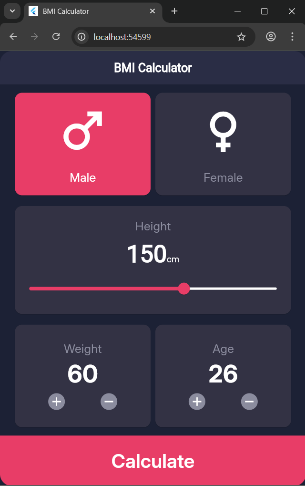
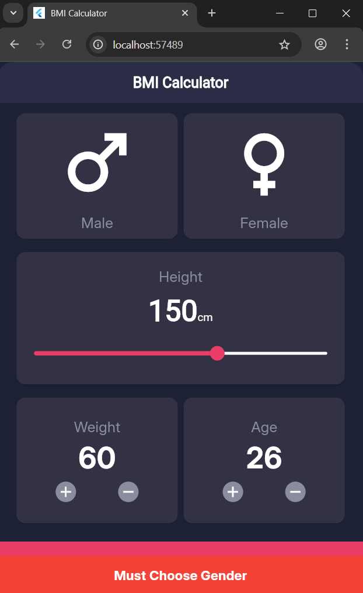
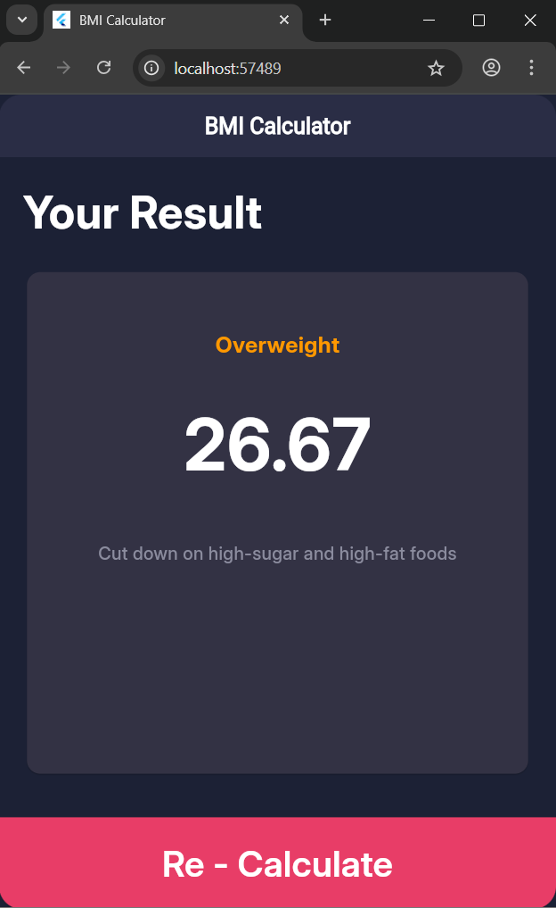

# BMI Calculator App ⚖️🚀

## Project Introduction 🎯

**Project Name**: BMI Calculator  

**Description**:  
A Flutter application that calculates **Body Mass Index (BMI)** based on user input: **gender, height, weight, and age**.  
The app provides instant results with feedback messages and recommendations.  
It is built with a clean structure, custom widgets, and reusable components to ensure a smooth user experience.  

---

## Technologies Used 💻

- **Programming Language**: Dart  
- **Framework**: Flutter  
- **UI/UX**: Custom reusable widgets with modern design  

---

## Widgets Used 🔧

- **Container**: For layout and decoration.  
- **Column / Row**: To align widgets vertically and horizontally.  
- **Text**: To display labels and values.  
- **Icon**: To show gender symbols and other icons.  
- **ElevatedButton**: For the main calculate button.  
- **InkWell**: To detect taps (e.g., gender selection).  
- **Slider**: For selecting height dynamically.  
- **Expanded**: To share space equally inside rows/columns.  
- **SizedBox**: To add spacing between elements.  
- **Scaffold**: Provides structure (AppBar, body, etc.).  
- **AppBar**: Top navigation bar with title.  
- **MaterialApp**: Root of the app, defines theme and navigation.  
- **Card / CustomCard**: Displays grouped content in styled containers.  
- **SnackBar**: For error feedback (e.g., "Must Choose Gender").  
- **Navigator**: To move between calculator page and result page.  

---

## Key Features 🛠️

- **Gender Selection**: Male / Female toggle cards.  
- **Height Input**: Adjustable with a slider (cm).  
- **Weight & Age Control**: Increment and decrement buttons.  
- **Validation**: User must select gender before calculation.  
- **Result Page**: Displays BMI value, category (Underweight, Normal, Overweight, Obese), and health recommendation.  
- **Recalculate Button**: Allows user to go back and try again.  

---

## Screenshots 📸

### 1. BMI Calculator Page (Default & With Selection)  
| Bmi Calculater Page |
| --- | --- |
|  |  |

### 2. Result Page  
  

---

## Project Structure 📂 

The project follows a clean and organized directory structure:

```plaintext
assets
├─ fonts
└─ images

build
└─ <build files>

lib
├─ constant
│ ├─ colors.dart
│ ├─ dimensions.dart
│ └─ strings.dart
├─ custom_widgets
│ ├─ calculate_button.dart
│ ├─ circular_button.dart
│ ├─ custom_card.dart
│ ├─ height_card.dart
│ ├─ male_female_card.dart
│ └─ weight_age_card.dart
├─ pages
│ ├─ bmi_calculater_page.dart
│ └─ bmi_result.dart
└─ main.dart

test
└─ widget_test.dart
